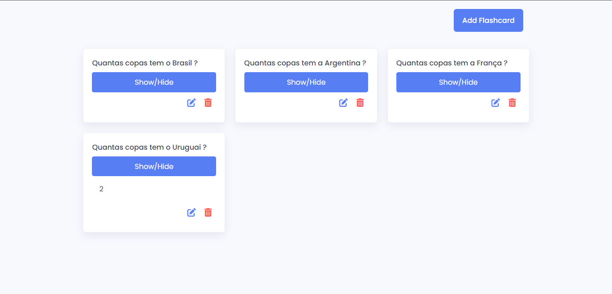

<div align="center">
    <h1 align="center">Creating Flashcard App Javascricpt 📌</h1>
    <p>Criação de um site com tema sobre flashcard</p>
    
</div>

---

<h3 align="center">
  <a href="https://flashcard-app-javascript.vercel.app/">Acessar demonstração</a>
</h3>

## Índice

- [Descrição](#descrição)
- [Techs](#techs)
- [Design](#design)
  - [Cores](#cores)
  - [Tipo de fonte](#tipo-de-fonte)
  - [Pacote de ícones](#pacote-de-ícones)
- [Instalação](#instalação)
- [Links Contato](#links-contato)

# Descrição

Criação de um site com tema sobre flashcard. [**@Code Artist**](https://www.youtube.com/c/CodingArtist)

# Techs:

- **HTML**
- **CSS**
- **Javascript**

# Design:

- O modelo final para desktop está disponível na pasta `./design`
- Imagens disponíveis na pasta `./assets`<br>

## Cores:
--black: #000;<br>
-white: #fff;<br>
--red: #ff5353;
--blue: #587ef4;<br>  

## Tipo de fonte:

- **Poppins** Regular 400, Medium 500, Bold 600

## Pacote de ícones:

- **Boxicons**

# Instalação:

```bash
  # Clone este repositório:
  $ git clone https://github.com/GabrielChagas1/flashcard-app-javascript.git
  $ cd ./flashcard-app-javascript
```

# Links Contato

- **Linkedin:** https://www.linkedin.com/in/gabriel-serqueira-chagas/<br>
- **GitHub:** https://github.com/GabrielChagas1<br>